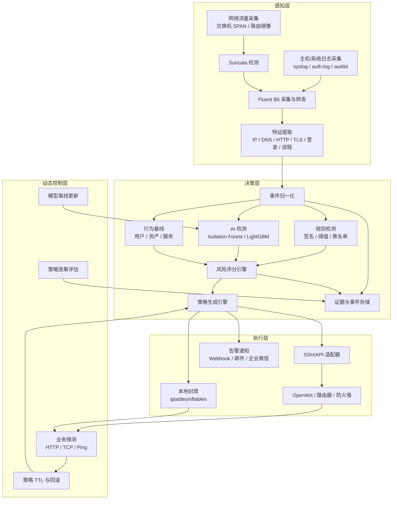
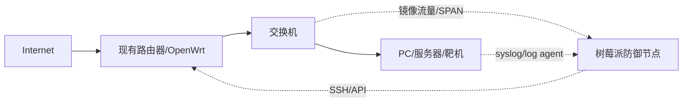

# Pi-Guard Lite 项目方案（树莓派低成本 AI 智能防御系统）

## 1. 项目概述

### 1.1 项目名称
**Pi-Guard Lite**

### 1.2 项目定位
基于树莓派构建一套**低成本、可独立落地、可闭环运行**的 AI 智能防御系统，适用于：

- 小型实验室
- 宿舍/家庭实验网络
- 小团队测试环境
- CTF/攻防演练边缘节点

### 1.3 项目目标
在 **800 RMB** 预算约束下，完成以下能力：

1. 采集网络流量与系统日志
2. 检测常见攻击与异常行为
3. 进行轻量 AI 风险评分
4. 自动联动路由器/防火墙执行封禁
5. 对防御策略进行业务探测和自动回滚
6. 提供最小可视化管理页面

---

## 2. 预算与硬件约束

### 2.1 预算上限
- 总预算：**≤ 800 RMB**

### 2.2 推荐硬件

#### 方案 A：推荐实用版（优先）
- **二手 Raspberry Pi 4B 4GB**

优点：
- 更适合 800 RMB 预算
- 4GB 内存更利于单节点运行
- 足够支持轻量 IDS + 日志处理 + Web 管理

#### 方案 B：备选版
- **全新 Raspberry Pi 5 2GB**

缺点：
- 内存偏小
- 预算几乎用满
- 软件栈需要进一步精简

### 2.3 建议最小 BOM

| 项目 | 建议 |
|---|---|
| 主板 | 二手 Raspberry Pi 4B 4GB |
| 存储 | 32GB microSD |
| 电源 | 5V/3A USB-C |
| 散热 | 散热片/简易风扇 |
| 网络 | 复用现有交换机镜像口或现有路由器 |

---

## 3. 总体架构设计

系统采用四层架构：

1. **感知层**
2. **决策层**
3. **执行层**
4. **动态控制层**

---

## 4. 分层架构图



---

## 5. 部署拓扑图



---

## 6. 各层详细设计

### 6.1 感知层

感知层负责采集和解析安全数据。

#### 6.1.1 数据采集范围

**网络流量：**
- 交换机 SPAN / mirror port
- 路由器导出日志
- DNS 请求
- HTTP/TLS 元数据
- TCP/UDP 会话行为

**系统日志：**
- `syslog`
- `auth.log`
- `auditd`
- Web 服务日志（如 `nginx/access.log`、`nginx/error.log`）

#### 6.1.2 感知层模块

##### 1）Suricata
作用：
- 深度包检测（DPI）
- 签名规则检测
- 异常流量识别
- 输出 `eve.json`

重点检测：
- SQL 注入
- RCE 利用流量
- SSH 爆破
- 端口扫描
- 异常 DNS
- 恶意外联

##### 2）Fluent Bit
作用：
- 采集 `eve.json`
- 采集系统日志
- 统一转为结构化 JSON
- 转发到本地处理模块

##### 3）特征提取器
提取特征包括：
- 源/目的 IP
- 协议、端口
- 域名、URI、User-Agent
- 登录失败次数
- 单位时间连接数
- 流量突增情况
- 历史告警重复次数

---

### 6.2 决策层

决策层负责判断风险、生成策略。

#### 6.2.1 事件归一化

统一事件格式，例如：

```json
{
  "ts": "2026-03-30T12:00:00+08:00",
  "src_ip": "10.0.0.10",
  "dst_ip": "10.0.0.2",
  "service": "web",
  "event_type": "http_anomaly",
  "severity": 3,
  "raw_ref": "eve-000123"
}
```

#### 6.2.2 检测机制

##### A. 规则检测
适用已知威胁：
- 黑名单命中
- SQLi 特征
- 暴力破解阈值
- 扫描阈值
- 可疑 DNS
- HTTP 高频访问异常

##### B. AI 异常检测
适用未知或变种威胁：

**Isolation Forest**
- 用于识别异常连接行为
- 识别非正常时间段流量
- 识别异常外联

**LightGBM**
- 用于风险分类
- 结合多特征进行打分
- 生成自动封禁建议

##### C. 行为基线
建立画像：
- 某 IP 平时访问哪些服务
- 某主机平时有哪些 DNS 行为
- 某账号平时登录时间段
- 某 URL 平时访问频率

#### 6.2.3 风险评分模型

建议公式：

```text
风险分 = 规则命中权重
      + 异常分
      + 资产重要性权重
      + 攻击频率权重
      + 历史恶意信誉权重
      - 白名单修正
```

风险等级建议：

| 分数 | 等级 | 动作 |
|---|---|---|
| 0 ~ 39 | 低危 | 记录 |
| 40 ~ 69 | 中危 | 告警/观察 |
| 70 ~ 84 | 高危 | 建议封禁 |
| 85 ~ 100 | 严重 | 自动封禁 + 强通知 |

#### 6.2.4 策略生成
支持动作：
- 封禁恶意 IP
- 对可疑源限速
- 临时封禁特定端口
- 写入路由器黑名单
- 本地防火墙封禁
- 通知管理员

---

### 6.3 执行层

执行层负责将策略真正落地。

#### 6.3.1 执行方式

##### 模式 A：联动现有路由器/防火墙
推荐方式：
- SSH
- REST API
- Webhook

可执行动作：
- 下发 `ipset`
- 更新 `iptables/nftables`
- 增加黑名单规则
- 设置限速规则

##### 模式 B：本地封禁
如果树莓派在网络路径中，可执行：
- `iptables`
- `nftables`
- `tc` 限速

#### 6.3.2 通知方式
- 企业微信机器人
- 邮件
- Webhook
- 本地 Dashboard

---

### 6.4 动态控制层

动态控制层负责验证策略是否影响业务，并进行回滚。

#### 6.4.1 业务探测
策略执行后执行：
- `curl` 访问核心页面
- TCP 端口探测
- Ping 网关
- 登录接口检查

#### 6.4.2 自动回滚
若探测失败：
- 回滚最近封禁策略
- 将封禁降级为限速
- 保留告警和证据

#### 6.4.3 模型更新
由于树莓派资源有限：
- 树莓派本地仅做推理
- 模型训练放到 PC/笔记本离线进行
- 训练后导出 `joblib` 或 `onnx`
- 上传树莓派热更新

---

## 7. 技术栈选型方案

### 7.1 最终推荐技术栈

| 层 | 组件 | 选型 |
|---|---|---|
| 操作系统 | OS | Raspberry Pi OS Lite 64-bit |
| 流量检测 | IDS | Suricata |
| 日志采集 | Log Collector | Fluent Bit |
| 后端服务 | API | FastAPI |
| 异常检测 | ML | scikit-learn |
| 风险分类 | ML | LightGBM |
| 数据存储 | DB | SQLite |
| 前端展示 | UI | FastAPI + Jinja2 + ECharts |
| 执行联动 | Executor | Python Paramiko / Requests |
| 本地封禁 | Firewall | iptables / nftables |
| 服务管理 | Process | systemd |
| 配置管理 | Config | YAML |
| 模型格式 | Model | joblib / ONNX |

### 7.2 选型理由

#### 不使用 Docker
- 单节点资源有限
- 4GB 内存下容器化有额外开销
- `systemd + venv` 更轻更稳定

#### 不使用 PostgreSQL / Redis / Elasticsearch
- SQLite 足以支撑单节点 MVP
- 降低存储和内存压力
- 降低运维复杂度

#### 不使用 Kafka / NATS
- 当前仅单机部署
- 数据量不大
- 直接本地处理即可

#### 不使用大模型
- 预算和算力不支持
- 轻量模型已足够支撑 MVP
- 更利于快速落地

---

## 8. 模块划分

建议项目目录结构如下：

```text
pi-guard-lite/
├─ app/
│  ├─ collector/
│  ├─ parser/
│  ├─ features/
│  ├─ detector/
│  ├─ scorer/
│  ├─ policy/
│  ├─ executor/
│  ├─ probe/
│  ├─ web/
│  └─ common/
├─ config/
│  ├─ app.yaml
│  ├─ suricata.yaml
│  ├─ fluent-bit.conf
│  └─ whitelist.yaml
├─ models/
├─ scripts/
├─ systemd/
├─ data/
│  ├─ pi_guard.db
│  └─ raw/
├─ logs/
├─ tests/
└─ requirements.txt
```

---

## 9. 数据流设计

### 9.1 主流程

```text
镜像流量 / 系统日志
    ↓
Suricata / Fluent Bit
    ↓
统一 JSON 事件
    ↓
特征提取
    ↓
规则检测 + AI 异常检测
    ↓
风险评分
    ↓
策略生成
    ↓
SSH/API 下发封禁
    ↓
业务探测
    ↓
成功则保留；失败则回滚
```

### 9.2 存储流

```text
原始日志 -> JSONL
解析后事件 -> SQLite
策略记录 -> SQLite
封禁历史 -> SQLite
模型文件 -> /models
```

---

## 10. 数据库设计

### 10.1 资产表 asset

| 字段 | 说明 |
|---|---|
| id | 主键 |
| ip | 资产 IP |
| hostname | 主机名 |
| asset_type | 资产类型 |
| importance | 重要等级 |
| owner | 负责人 |

### 10.2 事件表 event

| 字段 | 说明 |
|---|---|
| id | 主键 |
| ts | 时间 |
| src_ip | 源 IP |
| dst_ip | 目标 IP |
| event_type | 事件类型 |
| severity | 严重度 |
| anomaly_score | 异常分 |
| risk_score | 风险分 |
| raw_path | 原始日志路径 |

### 10.3 策略表 policy

| 字段 | 说明 |
|---|---|
| id | 主键 |
| event_id | 关联事件 |
| action | 动作 |
| target | 目标 |
| ttl | 生效时间 |
| status | 状态 |
| created_at | 创建时间 |

### 10.4 黑名单表 blocklist

| 字段 | 说明 |
|---|---|
| id | 主键 |
| target_ip | 被封禁 IP |
| source_reason | 原因 |
| expire_at | 到期时间 |
| status | 状态 |

### 10.5 探测结果表 probe_result

| 字段 | 说明 |
|---|---|
| id | 主键 |
| policy_id | 策略 ID |
| probe_target | 探测目标 |
| result | 结果 |
| latency_ms | 延迟 |
| created_at | 时间 |

---

## 11. 典型攻击场景闭环

### 场景：Web 爆破 + 异常外联

1. 攻击者高频请求 `/login`
2. Suricata 检测到异常流量特征
3. 系统日志出现大量认证失败
4. 特征提取器统计：
   - 单 IP 1 分钟内 300 次请求
   - 登录失败 80 次
   - 随后访问异常 DNS 域名
5. AI 模型识别为高偏离行为
6. 风险评分升至 88
7. 策略引擎生成：
   - 封禁源 IP 30 分钟
   - 发送管理员告警
8. 执行器通过 SSH 将 IP 写入 OpenWrt `ipset`
9. 动态控制层执行业务探测
10. 若业务正常，保留策略
11. 若业务异常，自动回滚并降级为限速

---

## 12. 关键性能目标

> 以下为该预算下的工程目标值，不是官方硬件指标。

| 指标 | 目标 |
|---|---|
| 单节点镜像流量 | 建议 ≤ 100 ~ 200 Mbps |
| 事件处理延迟 | P95 ≤ 3 秒 |
| 自动封禁响应 | ≤ 5 秒 |
| 策略回滚时间 | ≤ 10 秒 |
| 日志保留 | 7 ~ 15 天 |
| 原始 JSONL 留存 | 3 ~ 7 天 |
| 模型更新频率 | 每日 1 次 |

---

## 13. 第一版开发计划（6 周）

### 第 1 周：基础环境与项目骨架

任务：
- 安装 Raspberry Pi OS Lite 64-bit
- 配置 SSH、静态 IP、时区、自动启动
- 初始化项目目录
- 建立 Python venv
- 初始化 SQLite
- 编写 systemd 服务模板

输出物：
- 系统初始化脚本
- 项目骨架
- 数据库初始化文件
- systemd 服务文件

验收标准：
- 主服务可开机自启
- Web 健康检查接口可访问
- SQLite 可写入测试数据

---

### 第 2 周：感知层落地

任务：
- 安装并配置 Suricata
- 配置 AF_PACKET
- 开启 eve.json
- 安装并配置 Fluent Bit
- 编写 Suricata/syslog 解析器
- 统一事件字段

输出物：
- `suricata.yaml`
- `fluent-bit.conf`
- 事件标准模型
- 原始日志入库脚本

验收标准：
- 流量事件能写入数据库
- 能识别扫描、爆破、异常 DNS

---

### 第 3 周：决策层 MVP

任务：
- 定义特征字段
- 实现规则引擎
- 在 PC 上训练轻量模型
- 导出模型到树莓派
- 实现风险评分服务

输出物：
- 特征提取模块
- 风险评分模块
- 模型加载器
- 分级逻辑

验收标准：
- 可输出 `risk_score`
- 可区分低危/中危/高危事件

---

### 第 4 周：执行层与联动封禁

任务：
- 编写 OpenWrt/路由器 SSH 适配器
- 实现本地 `iptables/nftables` 封禁
- 支持 TTL 自动失效
- 实现手动解封接口
- 记录执行结果

输出物：
- 执行器模块
- 封禁/解封 API
- 策略执行日志

验收标准：
- 高风险事件可自动封禁
- 封禁结果可追踪
- TTL 到期自动解封

---

### 第 5 周：动态控制与回滚

任务：
- 实现 HTTP/TCP/Ping 探测
- 实现自动回滚
- 增加白名单机制
- 增加策略优先级逻辑
- 增加资产重要性权重

输出物：
- 探测模块
- 自动回滚模块
- 白名单配置
- 策略优先级逻辑

验收标准：
- 封禁后自动探测业务
- 业务异常时 10 秒内回滚
- 白名单资产不被自动封禁

---

### 第 6 周：可视化、联调、压测、发布

任务：
- 开发最小控制台
- 集成企业微信/Webhook/邮件通知
- 联调完整链路
- 测试典型攻击场景
- 完成部署文档和运维手册

输出物：
- Web 控制台
- 通知模块
- 测试报告
- 部署说明书

验收标准：
- 从检测到封禁可完整演示
- 页面可查看事件和策略
- 至少通过 3 个攻击场景测试
- 稳定运行 24 小时

---

## 14. 里程碑

| 周次 | 里程碑 |
|---|---|
| 第 1 周 | 系统和项目框架完成 |
| 第 2 周 | 感知层打通 |
| 第 3 周 | 风险评分可用 |
| 第 4 周 | 自动封禁闭环完成 |
| 第 5 周 | 动态控制完成 |
| 第 6 周 | MVP 发布可演示 |

---

## 15. 优先级规划

### P0（必须完成）
- Suricata 流量采集
- SQLite 存储
- 风险评分
- 自动封禁
- 自动回滚

### P1（建议完成）
- Web 页面
- 告警通知
- 白名单
- 资产重要性

### P2（后续增强）
- 蜜罐引流
- 多节点部署
- 图谱溯源
- 主机 Agent
- 更复杂模型

---

## 16. 风险与规避

| 风险 | 规避方式 |
|---|---|
| 内存不足 | 不使用 Docker、ELK、Kafka |
| microSD 容易损耗 | 控制日志量，定期归档 |
| 路由器接口不统一 | 优先做 SSH 命令模板 |
| 误封业务 | 启用探测 + TTL + 自动回滚 |
| 模型效果不稳定 | 第一版规则优先，AI 辅助 |

---

## 17. 最终方案定稿

### 17.1 推荐形态
- **单节点**
- **旁路检测**
- **联动现有路由器执行**
- **轻量 AI 风险评分**
- **自动回滚**

### 17.2 定稿技术栈
- Raspberry Pi OS Lite 64-bit
- Suricata
- Fluent Bit
- FastAPI
- scikit-learn
- LightGBM
- SQLite
- Jinja2 + ECharts
- iptables / nftables
- Paramiko / Requests
- systemd

---

## 18. 结论

在 **800 RMB** 预算下，最现实、最容易落地的方案是：

- 采用 **二手 Raspberry Pi 4B 4GB**
- 做 **单节点旁路检测**
- 使用 **轻量级规则 + 小模型** 实现安全检测
- 通过 **SSH/API 联动现有 OpenWrt 或路由器** 完成自动封禁
- 通过 **业务探测 + 回滚** 形成完整闭环

该方案具备：
- 可开发
- 可部署
- 可演示
- 可后续扩展

适合作为毕业设计、比赛项目、攻防实验平台或低成本安全设备原型。
